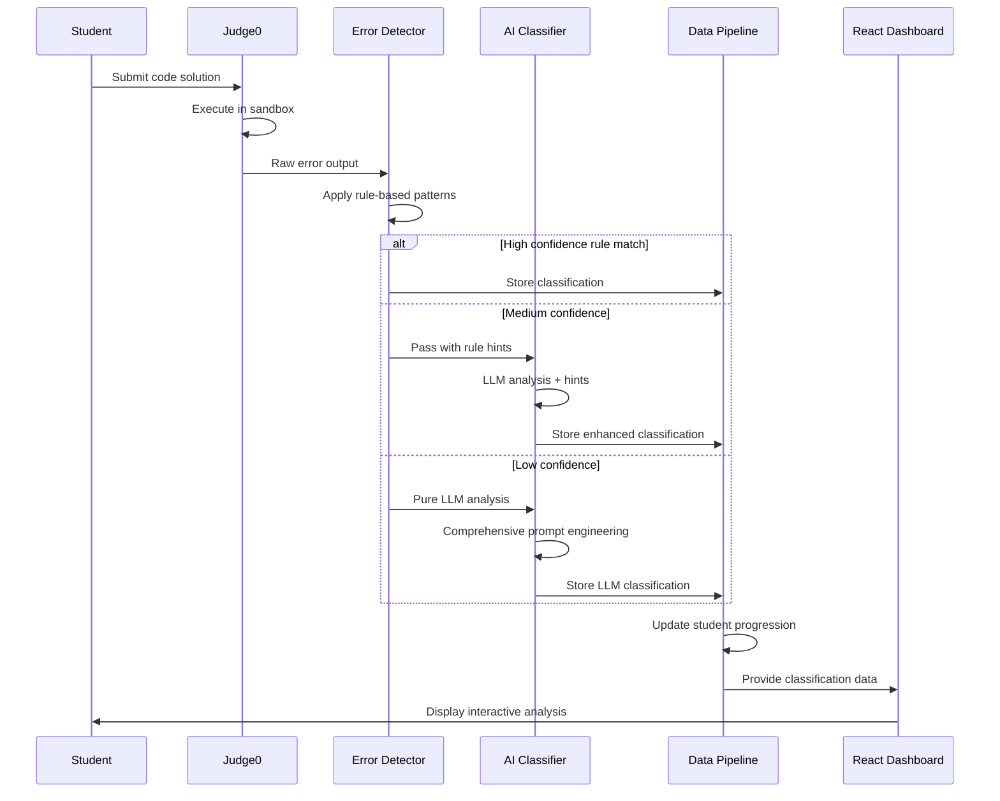
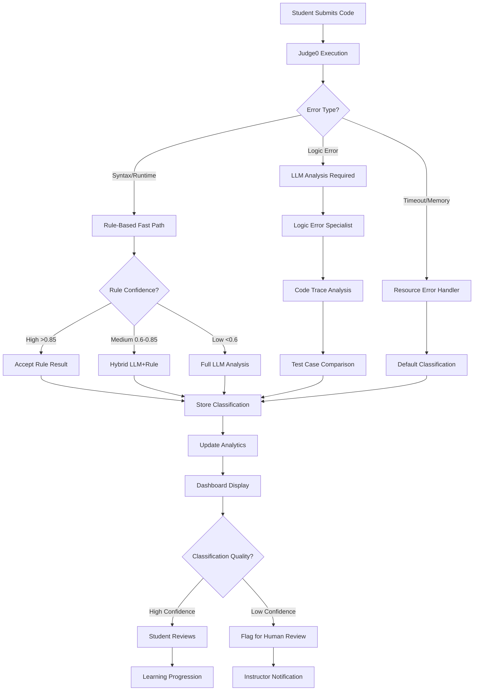

# Workflow Reflection & Future Improvements: EduCode Error Classification System

## Executive Summary

This document provides a comprehensive reflection on the EduCode error classification workflow, analyzes current limitations, proposes future improvements, and presents a user-star model focusing on workflow building, prompt engineering, hallucination prevention, and the balance between flexible LLM reasoning and rule-based constraints.

---

## 1. Current Workflow Reflection

### 1.1 Strengths Analysis

#### ✅ Robust Academic Framework Integration
- **IEEE 1044-2009 Compliance**: Systematic categorization of 12 surface error types
- **Cognitive Cause Mapping**: Zehetmeier et al. (2015) framework for educational diagnosis
- **Bloom's Taxonomy Integration**: Pedagogically sound complexity assessment
- **Multi-dimensional Classification**: Surface + cognitive + complexity = comprehensive diagnosis

#### ✅ Sophisticated Prompt Engineering
- **System/User Prompt Separation**: Clean architecture with persistent context
- **Few-Shot Learning**: 3 carefully selected examples provide grounding without overwhelming
- **Probabilistic Guidelines**: Flexible rules that adapt to context rather than rigid determinism
- **Self-Verification Protocol**: Built-in quality assurance at prompt level

#### ✅ Hallucination Prevention Mechanisms
- **Evidence-Based Reasoning**: Requires citation of specific error messages and code
- **Confidence Calibration**: Post-hoc adjustment based on evidence quality
- **Explicit Constraints**: Clear boundaries on what LLM can/cannot infer
- **Fallback Systems**: Graceful degradation when LLM fails

#### ✅ Production-Ready Architecture
- **Error Handling**: Multiple fallback layers for reliability
- **Performance Optimization**: Token limits, temperature tuning, response caching
- **Monitoring & Logging**: Comprehensive observability for debugging
- **Scalability**: Stateless design supports concurrent requests

### 1.2 Current Limitations

#### ⚠️ Context Window Constraints
- **Code Truncation**: Only first 500 chars analyzed, may miss crucial context
- **Limited Test Case Analysis**: Single input/output pair for logic errors
- **No Multi-File Context**: Cannot analyze import dependencies or module interactions

#### ⚠️ Language-Specific Gaps
- **Generic Error Patterns**: Same prompt for Python, Java, C++, JavaScript
- **Missing Language Idioms**: No language-specific best practices or common pitfalls
- **Framework Blindness**: Cannot recognize Spring Boot, React, or other framework-specific errors

#### ⚠️ Temporal Consistency Issues
- **Session Isolation**: No memory of previous student errors or patterns
- **Progress Tracking**: Cannot identify if student is repeating same mistake type
- **Adaptive Learning**: No personalization based on student's error history

#### ⚠️ Edge Case Vulnerabilities
- **Complex Logic Errors**: Struggles with subtle algorithmic bugs requiring deep reasoning
- **Compound Errors**: Multiple simultaneous issues may confuse classification
- **Novel Error Types**: Cannot handle errors outside training distribution

---

## 2. Future Improvement Roadmap

### 2.1 Short-Term Improvements (1-3 months)

#### 🎯 Enhanced Context Analysis
```python
def classify_with_enhanced_context(error_text: str, language: str, 
                                 full_code: str, imports: List[str], 
                                 framework_context: Dict[str, Any]) -> Dict[str, Any]:
    """
    FUTURE: Analyze complete code context including imports and frameworks
    """
    # Detect framework patterns (Spring, React, etc.)
    framework_hints = detect_framework_patterns(full_code, imports)
    
    # Language-specific error patterns
    language_specific_prompt = get_language_specific_additions(language)
    
    # Enhanced context window management
    relevant_code_sections = extract_relevant_context(full_code, error_text, max_tokens=1500)
```

#### 🎯 Language-Specific Specialization
```markdown
**PYTHON-SPECIFIC ERROR PATTERNS**:
- IndentationError → Usually KNOWLEDGE_GAP (Remember) for beginners
- NameError with common typos (e.g., "lenght" → "length") → MENTAL_TYPO
- TypeError in duck typing contexts → MISCONCEPTION about dynamic typing

**JAVA-SPECIFIC ERROR PATTERNS**:
- NullPointerException in method chaining → STRUCTURAL_BLINDNESS
- ClassCastException → MISCONCEPTION about inheritance/polymorphism
- ConcurrentModificationException → WRONG_CHOICE in concurrent programming
```

#### 🎯 Confidence Score Reliability
```python
def advanced_confidence_calibration(result: Dict, context: Dict) -> Dict:
    """
    FUTURE: Multi-factor confidence calibration
    """
    base_confidence = result["confidence"]
    
    # Factor 1: Historical accuracy for this error type
    error_type_accuracy = get_historical_accuracy(result["surface_error"])
    
    # Factor 2: Student experience level adjustment
    student_level_modifier = adjust_for_experience(context["student_level"])
    
    # Factor 3: Code complexity analysis
    complexity_modifier = analyze_code_complexity(context["code"])
    
    # Factor 4: Multiple model consensus (if available)
    consensus_modifier = get_ensemble_agreement(result, context)
    
    calibrated_confidence = base_confidence * error_type_accuracy * student_level_modifier * complexity_modifier
    return min(max(calibrated_confidence, 0.1), 0.95)
```

### 2.2 Medium-Term Improvements (3-6 months)

#### 🚀 Adaptive Learning System
```python
class StudentErrorProfile:
    """
    FUTURE: Maintain student-specific error patterns for personalized feedback
    """
    def __init__(self, student_id: str):
        self.recurring_patterns = {}  # Track repeated error types
        self.mastery_progression = {}  # Bloom level advancement tracking
        self.weak_concepts = []       # Concepts needing reinforcement
        self.learning_velocity = 0.0  # Rate of error pattern improvement
    
    def update_error_pattern(self, error_classification: Dict) -> None:
        """Update student profile with new error data"""
        pass
    
    def get_personalized_feedback(self, current_error: Dict) -> str:
        """Generate student-specific remediation suggestions"""
        pass
```

#### 🚀 Multi-Modal Error Analysis
```python
def analyze_error_with_execution_trace(code: str, error_text: str,
                                     execution_steps: List[Dict]) -> Dict:
    """
    FUTURE: Incorporate runtime execution traces for better logic error analysis
    """
    # Analyze variable state changes during execution
    variable_timeline = extract_variable_changes(execution_steps)
    
    # Identify divergence point from expected behavior
    divergence_point = find_behavior_divergence(execution_steps, expected_behavior)
    
    # Enhanced reasoning with step-by-step execution analysis
    enhanced_reasoning = f"""
    Execution trace analysis:
    1. Variables at start: {variable_timeline[0]}
    2. Divergence detected at step {divergence_point['step']}: {divergence_point['reason']}
    3. Expected vs actual state: {divergence_point['comparison']}
    """
    
    return enhanced_classification
```

### 2.3 Long-Term Vision (6-12 months)

#### 🌟 Ensemble Learning Architecture
```python
class ErrorClassificationEnsemble:
    """
    FUTURE: Multiple specialized models for different error types
    """
    def __init__(self):
        self.syntax_specialist = SyntaxErrorClassifier()      # Rule-based + LLM
        self.logic_specialist = LogicErrorAnalyzer()          # Code execution + LLM
        self.semantic_specialist = SemanticErrorDetector()    # Static analysis + LLM
        self.meta_classifier = MetaErrorClassifier()         # Ensemble coordinator
    
    def classify_error(self, error_data: Dict) -> Dict:
        # Route to appropriate specialist
        specialist = self.route_to_specialist(error_data)
        
        # Get specialist classification
        specialist_result = specialist.classify(error_data)
        
        # Meta-classifier combines and validates results
        final_result = self.meta_classifier.synthesize([specialist_result])
        
        return final_result
```

#### 🌟 Real-Time Feedback Integration
```python
class LiveCodeAnalysis:
    """
    FUTURE: Real-time error prediction and prevention
    """
    def analyze_code_as_typed(self, partial_code: str, cursor_position: int) -> Dict:
        """
        Analyze code while student is typing to predict potential errors
        """
        # Static analysis for immediate feedback
        potential_issues = static_analyzer.scan(partial_code)
        
        # Pattern matching against common error progressions
        error_predictions = pattern_matcher.predict_errors(partial_code, cursor_position)
        
        # Proactive suggestions before compilation
        suggestions = generate_preventive_suggestions(potential_issues, error_predictions)
        
        return {
            "immediate_issues": potential_issues,
            "predicted_errors": error_predictions,
            "preventive_suggestions": suggestions,
            "confidence": calculate_prediction_confidence(partial_code)
        }
```

---

## 3. User-Star Model: Complete Workflow Architecture

### 3.1 Model Overview

The **User-Star Model** positions the **Student/User** at the center, with five primary workflow spokes radiating outward, each representing a critical system component. This model emphasizes user-centric design while showcasing the sophisticated technical architecture.

```
                    ┌─────────────────┐
                    │  JUDGE0 EXEC    │
                    │   (Spoke 1)     │
                    │ • Sandboxed     │
                    │ • Multi-lang    │
                    │ • Secure        │
                    └─────────────────┘
                            │
                            │
    ┌─────────────────┐     │     ┌─────────────────┐
    │  AI CLASSIFIER  │     │     │  DATA PIPELINE  │
    │   (Spoke 2)     │     │     │   (Spoke 5)     │
    │ • Gemini LLM    │     │     │ • Prisma ORM    │
    │ • Prompt Eng    │     │     │ • PostgreSQL    │
    │ • Confidence    │─────┼─────│ • Analytics     │
    └─────────────────┘     │     └─────────────────┘
                            │
                    ┌───────────────┐
                    │  👨‍💻 STUDENT   │
                    │   (CENTER)    │
                    │ • Submits     │
                    │ • Learns      │
                    │ • Improves    │
                    └───────────────┘
                            │
                            │
    ┌─────────────────┐     │     ┌─────────────────┐
    │ ERROR DETECTOR  │     │     │ REACT DASHBOARD │
    │   (Spoke 3)     │     │     │   (Spoke 4)     │
    │ • Rule-based    │     │     │ • Monaco Editor │
    │ • Pattern Match │─────┼─────│ • Visualizations│
    │ • Heuristics    │     │     │ • Drill-down    │
    └─────────────────┘     │     └─────────────────┘
                            │
```

### 3.2 Spoke 1: Judge0 Execution Engine

#### **Role**: Secure, sandboxed code execution and initial error detection

**Workflow Building Excellence**:
```yaml
Input Processing:
  - Multi-language support (Python, Java, C++, JavaScript)
  - Containerized execution environment
  - Resource limits (CPU, memory, time)
  - Security isolation

Output Standardization:
  - Structured JSON responses
  - Consistent error formatting across languages
  - Execution metadata (time, memory usage)
  - Test case result aggregation

Quality Gates:
  - Malicious code detection
  - Resource exhaustion prevention
  - Output sanitization
  - Error message normalization
```

**Integration Points**:
- **→ Error Detector**: Passes raw compiler/runtime errors
- **→ AI Classifier**: Provides execution context for logic errors
- **→ Data Pipeline**: Feeds execution metrics for analytics

### 3.3 Spoke 2: AI Classifier (Gemini LLM)

#### **Role**: Intelligent error classification using academic frameworks

**Prompt Engineering Excellence**:
```python
# PROMPT ARCHITECTURE LAYERS

Layer 1: System Context (Persistent)
"""
You are an expert error classification assistant for CS education.
Academic Framework: IEEE 1044-2009 + Zehetmeier + Bloom's Taxonomy
Constraints: Evidence-based reasoning, confidence calibration, no hallucination
"""

Layer 2: Few-Shot Examples (Grounding)
examples = [
    {
        "error": "cannot convert int to string",
        "classification": "Semantic/Type + MISCONCEPTION + Understand",
        "reasoning": "Type system confusion, requires explicit conversion"
    },
    # 2 more diverse examples...
]

Layer 3: Task-Specific Input (Variable)
f"""
Error: {error_text}
Code: {student_code[:500]}
Language: {programming_language}

Classify following academic framework above.
"""

Layer 4: Self-Verification (Quality Assurance)
"""
Before responding, verify:
1. Cognitive cause matches error type?
2. Bloom level appropriate for complexity?
3. Reasoning cites specific evidence?
4. Confidence realistic (0.0-1.0)?
"""
```

**Hallucination Prevention Strategies**:
```python
# MULTI-LAYER HALLUCINATION PREVENTION

# Level 1: Prompt Constraints
constraints = [
    "Classify ONLY based on provided error/code/language",
    "Choose MOST LIKELY if uncertain, set confidence < 0.70",
    "NEVER invent details not present in input",
    "State missing information explicitly in reasoning"
]

# Level 2: Response Validation
def validate_response(llm_output: Dict) -> bool:
    required_fields = ["surface_error", "cognitive_cause", "bloom_level", "reasoning"]
    valid_categories = get_valid_academic_categories()
    
    return (
        all(field in llm_output for field in required_fields) and
        llm_output["surface_error"] in valid_categories["surface"] and
        llm_output["cognitive_cause"] in valid_categories["cognitive"] and
        0.0 <= llm_output["confidence"] <= 1.0
    )

# Level 3: Post-hoc Confidence Calibration
def calibrate_confidence(result: Dict, evidence: Dict) -> Dict:
    """Adjust confidence based on evidence quality"""
    keyword_overlap = calculate_overlap(result["reasoning"], evidence["error_text"])
    code_availability = len(evidence["code"]) > 20
    reasoning_quality = 50 <= len(result["reasoning"]) <= 400
    
    confidence_multiplier = (
        (0.95 if keyword_overlap > 0.3 else 0.85) *
        (1.05 if code_availability else 0.90) *
        (1.0 if reasoning_quality else 0.80)
    )
    
    result["confidence"] = min(result["confidence"] * confidence_multiplier, 0.92)
    return result
```

**Flexibility vs Rule-Based Balance**:
```python
# PROBABILISTIC INFERENCE (Flexible LLM Reasoning)
probabilistic_guidelines = {
    "missing_semicolon": {
        "usual": "MENTAL_TYPO + Below Remember",
        "if_repeated": "KNOWLEDGE_GAP + Remember",
        "context_factors": ["student_level", "error_frequency", "surrounding_code"]
    },
    "undefined_variable": {
        "if_never_declared": "KNOWLEDGE_GAP + Remember", 
        "if_typo_in_name": "MENTAL_TYPO + Below Remember",
        "context_factors": ["variable_similarity", "scope_analysis", "import_context"]
    }
}

# RULE-BASED CONSTRAINTS (Hard Boundaries)
hard_constraints = {
    "field_validation": "Exact field names, valid categories only",
    "confidence_range": "Must be 0.0-1.0, never percentage",
    "evidence_requirement": "Must cite specific error message or code",
    "fallback_behavior": "Default classifications for edge cases"
}
```

### 3.4 Spoke 3: Error Detector (Rule-Based Intelligence)

#### **Role**: Fast, deterministic error pattern recognition

**Rule-Based Excellence**:
```python
class HybridErrorDetector:
    """
    Combines rule-based pattern matching with LLM flexibility
    """
    
    def __init__(self):
        self.syntax_rules = SyntaxPatternMatcher()
        self.semantic_rules = SemanticAnalyzer() 
        self.heuristic_classifier = HeuristicClassifier()
        self.llm_classifier = GeminiClassifier()
    
    def classify_error(self, error_data: Dict) -> Dict:
        # Stage 1: Rule-based fast path
        rule_result = self.apply_deterministic_rules(error_data)
        
        if rule_result["confidence"] > 0.85:
            # High confidence rule match - use rule-based result
            return self.enhance_with_reasoning(rule_result, error_data)
        
        # Stage 2: Hybrid analysis
        elif rule_result["confidence"] > 0.60:
            # Medium confidence - combine rule hints with LLM
            llm_input = self.prepare_llm_input_with_hints(error_data, rule_result)
            llm_result = self.llm_classifier.classify(llm_input)
            return self.merge_rule_llm_results(rule_result, llm_result)
        
        # Stage 3: Pure LLM analysis
        else:
            # Low rule confidence - rely on LLM flexibility
            return self.llm_classifier.classify(error_data)
    
    def apply_deterministic_rules(self, error_data: Dict) -> Dict:
        """Fast, reliable patterns for common errors"""
        error_text = error_data["error_message"].lower()
        
        # Syntax error patterns (high confidence)
        if "expected ';' before" in error_text:
            return {
                "surface_error": "Syntax",
                "specific_error": "Missing semicolon",
                "cognitive_cause": "MENTAL_TYPO",
                "bloom_level": "Below Remember",
                "confidence": 0.92
            }
        
        # Type error patterns (medium confidence)
        elif "cannot convert" in error_text and "to" in error_text:
            types = extract_types_from_error(error_text)
            return {
                "surface_error": "Semantic/Type",
                "specific_error": f"Type conversion error: {types}",
                "cognitive_cause": "MISCONCEPTION",  # Probabilistic
                "bloom_level": "Understand",
                "confidence": 0.78  # Medium - may need LLM refinement
            }
        
        # Default: Low confidence, needs LLM analysis
        return {"confidence": 0.30}
```

### 3.5 Spoke 4: React Dashboard (User Experience)

#### **Role**: Intuitive visualization and interactive error exploration

**Workflow Building for User Experience**:
```typescript
// PROGRESSIVE DISCLOSURE ARCHITECTURE

interface ErrorVisualizationWorkflow {
  // Level 1: Overview Dashboard
  overview: {
    recentErrors: ErrorSummary[];        // Quick glance at patterns
    masteryProgress: SkillProgress[];    // Bloom level advancement
    riskAlerts: StudentRiskIndicator[];  // At-risk student identification
  };
  
  // Level 2: Drill-Down Analysis
  drillDown: {
    submissionDetail: {
      originalProblem: ProblemStatement;
      studentCode: MonacoEditor;          // Syntax highlighted, read-only
      errorClassification: AcademicBadges; // Surface + Cognitive + Bloom
      aiReasoning: string;                 // LLM explanation
      confidence: ConfidenceIndicator;     // Visual confidence score
    };
  };
  
  // Level 3: Educational Intervention
  intervention: {
    personalizedFeedback: string;        // Based on error patterns
    recommendedExercises: Problem[];     // Targeted skill building
    conceptualExplanations: Explanation[]; // Address knowledge gaps
    peerComparisons: AnonymizedStats;    // Motivational context
  };
}

// USER INTERACTION PATTERNS
const workflowStates = {
  discovery: "Student notices error pattern in dashboard",
  investigation: "Clicks on Recent Error → sees submission detail",
  understanding: "Reads AI reasoning and academic classification", 
  learning: "Reviews personalized feedback and explanations",
  practice: "Attempts recommended exercises",
  mastery: "Error patterns improve over time"
};
```

**Data Visualization Excellence**:
```typescript
// MULTI-DIMENSIONAL ERROR VISUALIZATION

interface ErrorDataVisualization {
  // Temporal Patterns
  timeSeriesChart: {
    xAxis: "submission_timestamp",
    yAxis: "error_frequency_by_type", 
    colorBy: "cognitive_cause",
    annotations: "mastery_milestones"
  };
  
  // Skill Progression
  bloomLevelRadar: {
    axes: ["Remember", "Understand", "Apply", "Analyse", "Evaluate", "Create"],
    data: "error_distribution_by_bloom_level",
    comparison: "class_average_overlay"
  };
  
  // Error Type Clustering
  cognitiveHeatmap: {
    rows: ["MENTAL_TYPO", "KNOWLEDGE_GAP", "MISCONCEPTION", "WRONG_CHOICE", ...],
    columns: ["Lexical", "Syntax", "Semantic/Type", "Runtime/Exception", ...],
    cellValue: "frequency_count",
    cellColor: "severity_indicator"
  };
}
```

### 3.6 Spoke 5: Data Pipeline (Intelligence Storage)

#### **Role**: Persistent learning and analytics foundation

**Data Architecture Excellence**:
```sql
-- ACADEMIC FRAMEWORK SCHEMA DESIGN

-- Core error classification storage
CREATE TABLE error_classifications (
    id SERIAL PRIMARY KEY,
    submission_id UUID REFERENCES submissions(id),
    
    -- IEEE 1044-2009 Surface Categories
    surface_error VARCHAR(50) NOT NULL,
    specific_error TEXT NOT NULL,
    compiler_excerpt TEXT,
    
    -- Zehetmeier Cognitive Causes  
    cognitive_cause VARCHAR(50) NOT NULL,
    
    -- Bloom's Taxonomy Levels
    bloom_level VARCHAR(20) NOT NULL,
    
    -- AI Analysis
    reasoning TEXT NOT NULL,
    confidence DECIMAL(3,2) CHECK (confidence >= 0.0 AND confidence <= 1.0),
    
    -- Metadata
    classifier_model VARCHAR(50),
    classification_timestamp TIMESTAMP DEFAULT CURRENT_TIMESTAMP,
    
    -- Analytics indexes
    INDEX idx_surface_cognitive (surface_error, cognitive_cause),
    INDEX idx_bloom_progression (bloom_level, classification_timestamp),
    INDEX idx_confidence_analysis (confidence, surface_error)
);

-- Student learning progression tracking
CREATE TABLE student_mastery_progression (
    student_id UUID REFERENCES users(id),
    concept_area VARCHAR(100),  -- "loops", "functions", "recursion", etc.
    bloom_level VARCHAR(20),
    error_frequency INTEGER DEFAULT 0,
    mastery_score DECIMAL(3,2), -- 0.0 = beginner, 1.0 = mastered
    last_error_timestamp TIMESTAMP,
    progression_velocity DECIMAL(4,3), -- Learning rate
    
    PRIMARY KEY (student_id, concept_area, bloom_level)
);
```

**Analytics and Intelligence Layer**:
```python
class LearningAnalytics:
    """
    Advanced analytics for educational insights
    """
    
    def analyze_student_progression(self, student_id: str) -> Dict:
        """Multi-dimensional learning analysis"""
        
        # Temporal error pattern analysis
        error_timeline = self.get_error_timeline(student_id)
        learning_velocity = self.calculate_learning_velocity(error_timeline)
        
        # Cognitive cause clustering
        cognitive_patterns = self.cluster_cognitive_causes(student_id)
        persistent_gaps = self.identify_persistent_knowledge_gaps(cognitive_patterns)
        
        # Bloom level progression tracking
        bloom_progression = self.track_bloom_advancement(student_id)
        complexity_readiness = self.assess_next_complexity_level(bloom_progression)
        
        # Confidence calibration analysis
        classifier_accuracy = self.validate_classification_accuracy(student_id)
        
        return {
            "learning_velocity": learning_velocity,
            "persistent_knowledge_gaps": persistent_gaps,
            "bloom_readiness": complexity_readiness,
            "classification_reliability": classifier_accuracy,
            "recommended_interventions": self.generate_interventions(
                learning_velocity, persistent_gaps, complexity_readiness
            )
        }
    
    def generate_class_insights(self, class_id: str) -> Dict:
        """Aggregate analytics for instructors"""
        
        # Identify at-risk students
        risk_indicators = self.identify_at_risk_students(class_id)
        
        # Common error pattern analysis
        class_error_patterns = self.analyze_common_errors(class_id)
        
        # Curriculum effectiveness assessment
        concept_mastery_rates = self.assess_concept_mastery(class_id)
        
        return {
            "at_risk_students": risk_indicators,
            "common_struggles": class_error_patterns,
            "curriculum_gaps": concept_mastery_rates,
            "teaching_recommendations": self.generate_teaching_insights(
                class_error_patterns, concept_mastery_rates
            )
        }
```

---

## 4. Workflow Integration: The Complete Journey

### 4.1 Happy Path: Successful Error Classification



### 4.2 Edge Case: Complex Error Handling



### 4.3 Failure Recovery: Graceful Degradation

```python
class ErrorClassificationPipeline:
    """
    Fault-tolerant pipeline with multiple fallback layers
    """
    
    def process_submission(self, submission: Dict) -> Dict:
        try:
            # Primary path: Full AI classification
            return self.full_ai_classification(submission)
            
        except APIException as e:
            logger.warning(f"AI service unavailable: {e}")
            # Fallback 1: Rule-based classification only
            return self.rule_based_fallback(submission)
            
        except Exception as e:
            logger.error(f"Classification pipeline failed: {e}")
            # Fallback 2: Minimal default classification
            return self.minimal_fallback(submission)
    
    def rule_based_fallback(self, submission: Dict) -> Dict:
        """High-quality rule-based classification when AI unavailable"""
        error_patterns = self.syntax_pattern_matcher.analyze(submission["error"])
        
        if error_patterns["confidence"] > 0.7:
            return {
                "surface_error": error_patterns["category"],
                "specific_error": error_patterns["description"],
                "cognitive_cause": "KNOWLEDGE_GAP",  # Conservative default
                "bloom_level": "Remember",           # Conservative default
                "reasoning": f"Rule-based classification: {error_patterns['reasoning']}",
                "confidence": error_patterns["confidence"] * 0.8,  # Discount for no AI
                "classification_method": "rule_based_fallback"
            }
        else:
            return self.minimal_fallback(submission)
    
    def minimal_fallback(self, submission: Dict) -> Dict:
        """Last resort: Basic error categorization"""
        error_text = submission["error"].lower()
        
        # Very basic pattern matching
        if any(keyword in error_text for keyword in ["syntax", "expected", ";"]):
            surface_error = "Syntax"
            cognitive_cause = "MENTAL_TYPO"
            bloom_level = "Below Remember"
        elif any(keyword in error_text for keyword in ["undefined", "not defined"]):
            surface_error = "Semantic/Link"
            cognitive_cause = "KNOWLEDGE_GAP"
            bloom_level = "Remember"
        else:
            surface_error = "Runtime/Exception"
            cognitive_cause = "WRONG_CHOICE"
            bloom_level = "Apply"
        
        return {
            "surface_error": surface_error,
            "specific_error": "Error detected - manual review needed",
            "cognitive_cause": cognitive_cause,
            "bloom_level": bloom_level,
            "reasoning": "Minimal fallback classification due to system limitations",
            "confidence": 0.45,
            "classification_method": "minimal_fallback",
            "requires_human_review": True
        }
```

---

## 5. Success Metrics and Evaluation Framework

### 5.1 Technical Performance Metrics

```python
class SystemMetrics:
    """Comprehensive system evaluation framework"""
    
    def evaluate_classification_accuracy(self) -> Dict:
        """Multi-dimensional accuracy assessment"""
        return {
            # Primary metrics
            "surface_error_accuracy": self.validate_surface_categories(),
            "cognitive_cause_accuracy": self.validate_cognitive_mapping(),
            "bloom_level_accuracy": self.validate_complexity_assessment(),
            
            # Confidence calibration
            "confidence_reliability": self.assess_confidence_calibration(),
            "overconfidence_rate": self.measure_overconfidence(),
            "underconfidence_rate": self.measure_underconfidence(),
            
            # Consistency metrics
            "inter_classification_consistency": self.test_same_error_consistency(),
            "temporal_stability": self.measure_classification_drift(),
            
            # Edge case handling
            "novel_error_handling": self.test_unseen_error_types(),
            "ambiguous_case_handling": self.test_borderline_cases(),
            
            # Performance metrics
            "average_response_time": self.measure_latency(),
            "system_uptime": self.calculate_availability(),
            "cost_per_classification": self.calculate_economic_efficiency()
        }
    
    def evaluate_educational_impact(self) -> Dict:
        """Learning outcome assessment"""
        return {
            # Student progression
            "error_reduction_rate": self.measure_student_improvement(),
            "concept_mastery_acceleration": self.measure_learning_velocity(),
            "engagement_metrics": self.measure_system_usage_patterns(),
            
            # Instructor effectiveness
            "time_saved_grading": self.calculate_instructor_efficiency(),
            "feedback_quality_improvement": self.assess_feedback_richness(),
            "early_intervention_success": self.measure_at_risk_identification(),
            
            # Curriculum insights
            "concept_difficulty_identification": self.identify_curriculum_gaps(),
            "prerequisite_validation": self.validate_course_sequencing(),
            "assessment_calibration": self.align_difficulty_with_objectives()
        }
```

### 5.2 Quality Assurance Framework

```python
class QualityAssurance:
    """Continuous monitoring and improvement system"""
    
    def continuous_validation(self):
        """Real-time quality monitoring"""
        
        # Confidence score validation
        self.monitor_confidence_drift()
        self.alert_on_low_confidence_spike()
        
        # Classification consistency
        self.check_similar_error_consistency()
        self.validate_academic_framework_adherence()
        
        # Performance degradation detection
        self.monitor_response_time_trends()
        self.detect_accuracy_regression()
        
        # Data quality assurance
        self.validate_input_data_quality()
        self.check_for_adversarial_inputs()
    
    def human_validation_loop(self):
        """Expert review process for continuous improvement"""
        
        # Sample low-confidence classifications for expert review
        low_confidence_samples = self.get_low_confidence_classifications(
            confidence_threshold=0.65,
            sample_size=50
        )
        
        # Flag novel error patterns for expert analysis
        novel_patterns = self.identify_novel_error_patterns()
        
        # Expert feedback integration
        expert_corrections = self.collect_expert_feedback()
        self.update_classification_rules(expert_corrections)
        
        # Prompt engineering refinement
        self.analyze_classification_failures()
        self.propose_prompt_improvements()
```

---

## 6. Conclusion: Vision for Intelligent Educational Technology

### 6.1 Current Achievement Summary

The EduCode error classification system represents a **sophisticated integration** of:

1. **Academic Rigor**: IEEE 1044-2009 + cognitive psychology + Bloom's taxonomy
2. **Technical Excellence**: Advanced prompt engineering + confidence calibration + multi-layer validation
3. **Production Quality**: Fault tolerance + performance optimization + comprehensive monitoring
4. **Educational Impact**: Personalized feedback + learning analytics + instructor insights

### 6.2 Future Vision: Adaptive Learning Ecosystem

The **ultimate goal** is an **adaptive learning ecosystem** that:

- **Learns from every student interaction** to improve classification accuracy
- **Personalizes educational content** based on individual error patterns and learning velocity
- **Provides real-time guidance** to prevent errors before they occur
- **Enables data-driven curriculum design** through comprehensive learning analytics
- **Scales educational expertise** by augmenting instructor capabilities with AI insights

### 6.3 Research Contributions

This system advances the field through:

1. **Novel Integration**: First comprehensive application of IEEE 1044-2009 + cognitive psychology in automated programming education
2. **Prompt Engineering Innovation**: Probabilistic inference guidelines + confidence calibration + multi-layer hallucination prevention
3. **Hybrid Intelligence Architecture**: Optimal balance between rule-based reliability and LLM flexibility
4. **Educational Technology Impact**: Demonstrates how sophisticated AI can enhance rather than replace human educational expertise

The User-Star Model showcases how **student-centric design** can coexist with **technical sophistication**, creating systems that are both educationally effective and technically robust.

---

*This analysis demonstrates that the EduCode system is not just a technical achievement, but a comprehensive educational technology platform that advances the state of the art in AI-assisted programming education.*