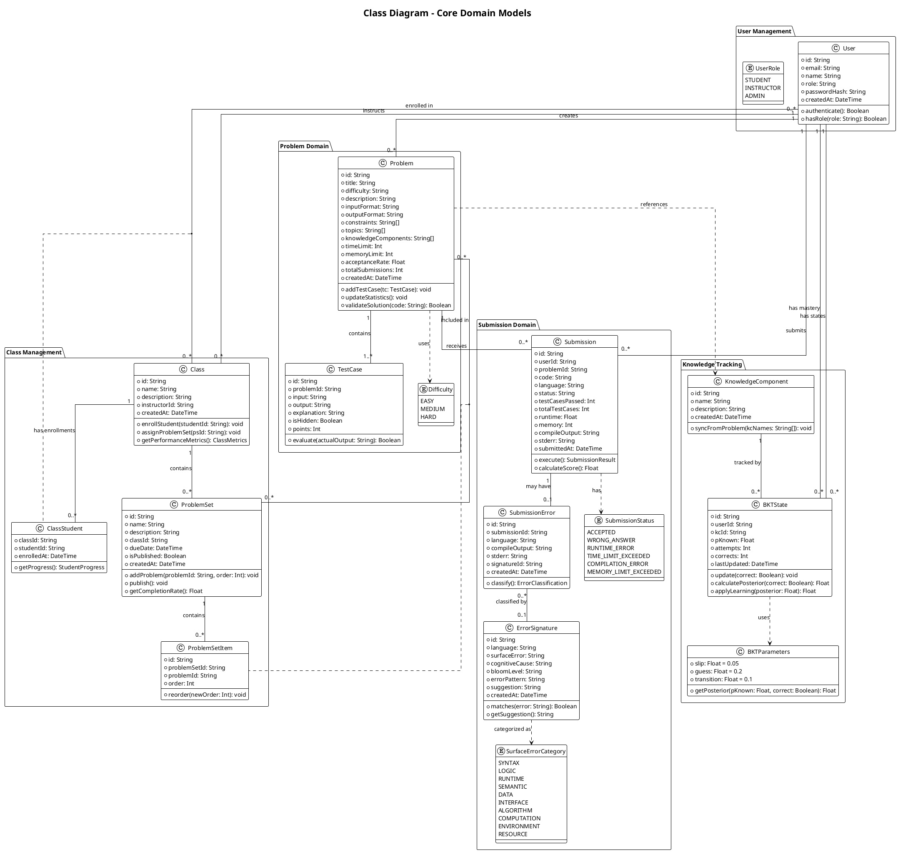

# Class Diagram - EduCode Adaptive Platform

## Domain Model Description

### User Management
- **User**: Core entity representing students, instructors, and admins
- **UserRole**: Enum defining access levels and permissions

### Problem Domain
- **Problem**: Programming challenges with test cases
- **TestCase**: Input/output pairs for validating solutions
- **Difficulty**: Three-tier difficulty classification

### Submission Domain
- **Submission**: Student's code submission with execution results
- **SubmissionError**: Detailed error information for failed submissions
- **ErrorSignature**: Pattern-matched error classifications with suggestions
- **SubmissionStatus**: All possible submission outcomes
- **SurfaceErrorCategory**: IEEE 1044 error taxonomy

### Knowledge Tracking (BKT)
- **KnowledgeComponent**: Programming concepts (e.g., "arrays", "recursion")
- **BKTState**: Per-user-per-KC mastery probability
- **BKTParameters**: Bayesian model parameters (slip, guess, transition)

### Class Management
- **Class**: Instructor-led course with enrolled students
- **ClassStudent**: Many-to-many join entity for class enrollment
- **ProblemSet**: Curated collection of problems (assignments)
- **ProblemSetItem**: Ordered problems within a problem set

## Key Design Patterns

### 1. Aggregate Roots
- **User**: Root for user-related data (submissions, BKT states)
- **Problem**: Root for problem-related data (test cases)
- **Class**: Root for class-related data (enrollments, problem sets)

### 2. Value Objects
- **BKTParameters**: Immutable configuration for BKT calculations
- **Difficulty**: Enumeration ensuring valid values
- **UserRole**: Enumeration for type safety

### 3. Repository Pattern
Each aggregate root has a corresponding repository:
- `UserRepository`
- `ProblemRepository`
- `SubmissionRepository`
- `ClassRepository`

### 4. Domain Events (Implicit)
- `SubmissionCreated` → Trigger code execution
- `SubmissionGraded` → Update BKT states
- `ErrorDetected` → Classify error
- `ProblemCreated` → Sync knowledge components

## Constraints and Invariants

### Database Constraints
- `User.email`: Unique
- `KnowledgeComponent.name`: Unique
- `BKTState(userId, kcId)`: Composite unique
- `ClassStudent(classId, studentId)`: Composite unique
- `ProblemSetItem.order`: Unique within problem set

### Business Rules
- `BKTState.pKnown`: 0.0 ≤ pKnown ≤ 1.0
- `Problem.acceptanceRate`: 0.0 ≤ rate ≤ 100.0
- `TestCase.points`: points > 0
- `User.role`: Must be valid UserRole
- `Submission.status`: Must be valid SubmissionStatus

### Cascading Deletes
- Delete Problem → Delete TestCases
- Delete Submission → Delete SubmissionError
- Delete Class → Delete ClassStudent, ProblemSet
- Delete ProblemSet → Delete ProblemSetItem
