# System Sequence Diagram - Code Submission Flow

```plantuml
@startuml
autonumber
title System Sequence Diagram - Student Submits Code Solution

actor Student
participant "Frontend\n(Next.js)" as FE
participant "Backend\n(Express)" as BE
participant "Judge0\nAPI" as J0
participant "AI Service\n(FastAPI)" as AI
database "PostgreSQL" as DB

== Authentication ==
Student -> FE: Navigate to problem page
FE -> BE: GET /api/problems/:id
BE -> DB: SELECT * FROM problems WHERE id=?
DB --> BE: Problem details + test cases
BE --> FE: Problem data (JSON)
FE --> Student: Display problem + code editor

== Code Submission ==
Student -> FE: Write code + click "Submit"
FE -> FE: Validate code not empty
FE -> BE: POST /api/code-execution\n{problemId, code, language}
note right
  Authorization: Bearer <JWT>
  Body: {
    problemId: "abc-123",
    code: "def solve(arr)...",
    language: "python"
  }
end note

BE -> BE: authenticateToken middleware\nExtract userId from JWT

== Code Execution via Judge0 ==
loop For each test case
    BE -> J0: POST /submissions\n{source_code, stdin, expected_output}
    note right
      {
        source_code: base64(code),
        language_id: 71 (Python),
        stdin: base64(testInput),
        cpu_time_limit: 5,
        memory_limit: 256000
      }
    end note
    
    J0 --> BE: {token: "xyz-789", status: {id: 1}}
    
    BE -> J0: GET /submissions/xyz-789
    J0 --> BE: {status: {id: 1, description: "Processing"}}
    
    loop While status = "Processing" (max 10 attempts)
        BE -> BE: Wait 500ms
        BE -> J0: GET /submissions/xyz-789
        J0 --> BE: {status: {id: 3}, stdout, time, memory}
    end
    
    BE -> BE: Compare stdout with expected output\nDetermine testPassed (boolean)
end

BE -> BE: Calculate overall status\n(accepted if all tests pass)

== Store Submission ==
BE -> DB: INSERT INTO submissions\n{userId, problemId, code, status, ...}
DB --> BE: Submission created (id)

alt Status != "accepted"
    == Error Classification ==
    BE -> AI: POST /classify\n{code, error, language}
    note right
      {
        code: "def solve(arr)...",
        compiler_error: "SyntaxError: ...",
        runtime_error: "IndexError: ...",
        language: "python"
      }
    end note
    
    AI -> AI: Parse error output\nExtract error type & line
    AI -> AI: Query LLM with prompt:\n"Classify this error in 3 dimensions..."
    
    AI --> BE: {surfaceError: "Runtime",\ncognitiveCause: "Carelessness",\nbloomLevel: "Apply",\nsuggestion: "..."}
    
    BE -> DB: INSERT INTO submission_errors\n{submissionId, ...}
    BE -> DB: INSERT INTO error_signatures\n{language, surfaceError, ...}
    DB --> BE: Error stored
end

== Update BKT States ==
BE -> DB: SELECT knowledgeComponents FROM problems\nWHERE id = ?
DB --> BE: ["arrays", "two_pointers"]

loop For each knowledge component
    BE -> BE: bkt.service.updateBKTLocal(userId, kcName, correct)
    BE -> DB: SELECT * FROM knowledge_component\nWHERE name = ?
    DB --> BE: {id: "kc-123", name: "arrays"}
    
    BE -> DB: SELECT * FROM bkt_state\nWHERE userId = ? AND kcId = ?
    alt BKT state exists
        DB --> BE: {pKnown: 0.35, attempts: 5, corrects: 3}
        BE -> BE: Calculate posterior using Bayes:\npKnown_new = f(pKnown, correct, S, G, T)
    else BKT state doesn't exist
        DB --> BE: null
        BE -> DB: INSERT INTO bkt_state\n{userId, kcId, pKnown: 0.2}
        DB --> BE: BKT state created
    end
    
    BE -> DB: UPDATE bkt_state\nSET pKnown = ?, attempts++, corrects++
    DB --> BE: Updated
end

== Update Problem Statistics ==
BE -> DB: UPDATE problems\nSET totalSubmissions++,\nacceptanceRate = ...
DB --> BE: Updated

== Return Results ==
BE --> FE: {status: "accepted",\ntestCasesPassed: 5,\ntotalTestCases: 5,\nruntime: 0.023,\nmemory: 4096}

FE -> FE: Update UI with results\nShow success/error message

FE --> Student: Display submission results\n+ test case details + metrics

alt Error occurred
    Student -> FE: Click "View Error Explanation"
    FE --> Student: Show AI-generated suggestion
end

== View Updated Mastery ==
Student -> FE: Navigate to dashboard
FE -> BE: GET /api/dashboard/student/:id
BE -> DB: SELECT * FROM bkt_state\nWHERE userId = ?
DB --> BE: [{kc: "arrays", pKnown: 0.42}, ...]
BE --> FE: {kcMastery: [...], submissions: [...]}
FE --> Student: Display updated mastery chart\n(arrays: 42% → 52%)

@enduml
```



## Sequence Diagram Description

### Phase 1: Authentication & Problem Loading (Steps 1-5)
**Purpose**: Student accesses a specific problem to solve

**Flow**:
1. Student navigates to `/problems/:id`
2. Frontend fetches problem details from backend
3. Backend queries database for problem + test cases
4. Frontend displays problem description and code editor
5. Student writes solution code

**Key Data**: Problem object with description, constraints, test cases, knowledge components

---

### Phase 2: Code Submission (Steps 6-9)
**Purpose**: Student submits code for evaluation

**Flow**:
6. Student clicks "Submit" button
7. Frontend validates code is not empty
8. Frontend sends POST request to `/api/code-execution` with JWT token
9. Backend middleware authenticates user and extracts `userId`

**Key Data**: `{problemId, code, language, userId}`

---

### Phase 3: Code Execution via Judge0 (Steps 10-19)
**Purpose**: Execute code against test cases in sandboxed environment

**Flow**:
10-12. **For each test case**, backend sends code + input to Judge0
13. Judge0 returns submission token
14-18. Backend **polls** Judge0 until execution completes (max 10 attempts, 500ms intervals)
19. Backend compares actual output with expected output

**Key Implementation Details**:
- Code is base64-encoded before sending to Judge0
- Polling prevents timeout on long-running submissions
- Each test case evaluated independently
- Status mapping: `1-2` = Processing, `3` = Accepted, `4` = Wrong Answer, `5` = TLE, `6` = Compilation Error

**Performance**:
- Typical execution time: 500ms - 2s per test case
- 5 test cases = 2.5s - 10s total

---

### Phase 4: Store Submission (Steps 20-21)
**Purpose**: Persist submission results in database

**Flow**:
20. Backend inserts submission record with all execution details
21. Database returns submission ID

**Key Data**: `{userId, problemId, code, language, status, testCasesPassed, totalTestCases, runtime, memory, compileOutput, stderr, submittedAt}`

---

### Phase 5: Error Classification (Steps 22-29) [Conditional]
**Purpose**: If submission failed, classify error using AI

**Condition**: Only runs if `status != "accepted"`

**Flow**:
22-23. Backend sends error details to AI service
24. AI service parses error output (syntax error, runtime error, etc.)
25. AI service queries LLM with classification prompt
26. AI service returns 3-dimensional classification
27-29. Backend stores error in `submission_errors` and `error_signatures` tables

**LLM Prompt Structure**:
```
Classify this coding error in 3 dimensions:
1. Surface Error (IEEE 1044): [Syntax|Logic|Runtime|...]
2. Cognitive Cause (Zehetmeier): [Lack of Knowledge|Misconception|...]
3. Bloom's Level: [Remember|Understand|Apply|Analyze|...]

Code: {source_code}
Error: {error_output}
Language: {language}
```

**Output Example**:
```json
{
  "surfaceError": "Runtime",
  "cognitiveCause": "Carelessness",
  "bloomLevel": "Apply",
  "suggestion": "IndexError on line 5: Check array bounds before accessing index."
}
```

---

### Phase 6: Update BKT States (Steps 30-42)
**Purpose**: Update student's mastery for each knowledge component

**Flow**:
30-31. Backend fetches problem's knowledge components (e.g., `["arrays", "two_pointers"]`)
32-42. **For each KC**:
   - Find KC in `KnowledgeComponent` table (auto-created by KC sync)
   - Check if `BKTState` exists for `(userId, kcId)` pair
   - If exists: Fetch current `pKnown` value
   - If not: Create new state with default `pKnown = 0.2`
   - Calculate posterior probability using Bayesian formula
   - Update `pKnown`, increment `attempts`, increment `corrects` (if correct)

**BKT Calculation** (simplified):
```typescript
const S = 0.05;  // Slip probability
const G = 0.2;   // Guess probability
const T = 0.1;   // Transition (learning) probability

if (correct) {
  posterior = (pKnown * (1 - S)) / (pKnown * (1 - S) + (1 - pKnown) * G);
} else {
  posterior = (pKnown * S) / (pKnown * S + (1 - pKnown) * (1 - G));
}

pKnown_new = posterior + (1 - posterior) * T;
```

**Example**:
- Initial: `pKnown = 0.2` (20% mastery)
- Student solves correctly: `pKnown = 0.35` (35%)
- Student solves again: `pKnown = 0.52` (52%)

---

### Phase 7: Update Problem Statistics (Steps 43-44)
**Purpose**: Track problem-level metrics

**Flow**:
43. Increment `totalSubmissions` counter
44. Recalculate `acceptanceRate` = (previous total * rate + new result) / new total

**Formula**:
```
If accepted:
  acceptanceRate = (acceptanceRate * totalSubmissions + 100) / (totalSubmissions + 1)
Else:
  acceptanceRate = (acceptanceRate * totalSubmissions) / (totalSubmissions + 1)
```

---

### Phase 8: Return Results to Student (Steps 45-48)
**Purpose**: Display submission outcome to student

**Flow**:
45. Backend returns submission results as JSON
46. Frontend updates UI (success/error banner, test case breakdown)
47. Frontend displays results page
48. Student can optionally view AI-generated error explanation

**UI Display**:
- Status badge (✅ Accepted, ❌ Wrong Answer, etc.)
- Test cases: 5/5 passed
- Runtime: 23ms
- Memory: 4.1 MB
- Error explanation (if failed)

---

### Phase 9: View Updated Mastery (Steps 49-53)
**Purpose**: Student sees updated knowledge mastery on dashboard

**Flow**:
49. Student navigates to dashboard
50. Frontend requests dashboard data
51-52. Backend fetches all `BKTState` records for student
53. Frontend displays mastery chart with updated percentages

**Dashboard Display**:
- Knowledge Mastery chart: "arrays: 52%", "two_pointers: 35%"
- Recent submissions list
- Recommended problems based on low-mastery KCs

---

## Alternative Flows

### Alt 1: Judge0 Timeout (Step 18)
```
BE -> J0: GET /submissions/xyz-789 (10th attempt)
J0 --> BE: {status: {id: 1, description: "Processing"}}
BE -> BE: Max retries exceeded
BE --> FE: {status: "error", message: "Execution timeout"}
```

### Alt 2: Compilation Error (Step 15)
```
J0 --> BE: {status: {id: 6}, compile_output: "SyntaxError: ..."}
BE -> BE: status = "compilation_error"
Skip test case loop
Proceed to error classification
```

### Alt 3: Knowledge Component Not Found (Step 36)
```
DB --> BE: null (KC doesn't exist)
BE -> BE: Log warning "KC not found: arrays"
BE -> BE: Skip BKT update for this KC
```
**Note**: After implementing ADR-006 (KC Sync), this scenario should never occur.

---

## Performance Characteristics

| Phase | Duration | Bottleneck |
|-------|----------|------------|
| Authentication & Problem Load | 100-300ms | Database query |
| Code Submission (validation) | <10ms | Client-side |
| Judge0 Execution (per test) | 500ms-2s | External API |
| Judge0 Execution (5 tests) | 2.5s-10s | Network + compute |
| Store Submission | 50-100ms | Database write |
| Error Classification | 1-3s | LLM inference |
| BKT Updates (3 KCs) | 100-200ms | 3 DB queries + 3 updates |
| Problem Statistics | 50ms | DB update |
| **Total (Success)** | **3-12s** | Judge0 dominates |
| **Total (Error)** | **4-15s** | Judge0 + LLM |

---

## Data Consistency Guarantees

### Transactional Boundaries
- **Submission Creation**: Atomic (single INSERT)
- **Error Storage**: Atomic (single transaction for both tables)
- **BKT Update**: Atomic per KC (each UPDATE in separate transaction)
- **Problem Stats**: Atomic (single UPDATE)

### Idempotency
- **Judge0 Polling**: Idempotent (GET requests, same token)
- **BKT Update**: Not idempotent (multiple updates increment counters)
- **Submission Storage**: Not idempotent (creates duplicate submissions)

**Implication**: Frontend should prevent double-submission (disable button during execution)

---

## Error Handling

### Judge0 Failures
- **Scenario**: Judge0 API returns 500 error
- **Response**: Return `{status: "error", message: "Code execution service unavailable"}`
- **UX**: Show error banner, allow retry

### AI Service Failures
- **Scenario**: AI service timeout or error
- **Response**: Store submission without error classification
- **UX**: Show submission results, skip error explanation

### Database Failures
- **Scenario**: PostgreSQL connection lost
- **Response**: Return 500 error to frontend
- **UX**: Show "System error, please try again"

### BKT Update Failures
- **Scenario**: KC not found in database
- **Response**: Log warning, skip that KC, continue with others
- **Impact**: Mastery not updated for missing KC

---

## Security Considerations

1. **Authentication**: JWT token validated on every request
2. **Authorization**: UserId from token, not request body (prevents impersonation)
3. **Code Sandboxing**: Judge0 executes in isolated containers
4. **Input Validation**: Code length limits, language whitelist
5. **Rate Limiting**: Prevent submission spam (future enhancement)

---

## Related Diagrams
- **Use Case Diagram**: Shows UC8 (Submit Solution) in context
- **Class Diagram**: Shows data models (Submission, BKTState, ErrorSignature)
- **Deployment Diagram**: Shows Judge0 as external service
