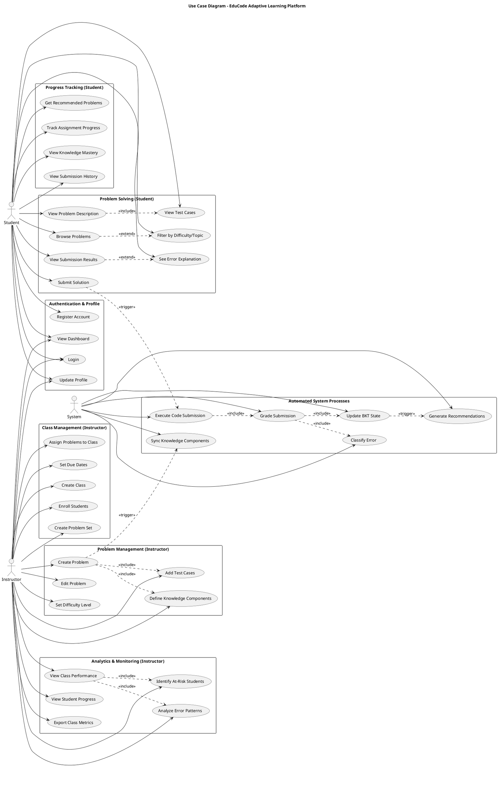

# Use Case Diagram - EduCode Adaptive Platform

## Use Case Descriptions

### Authentication & Profile
| Use Case | Actor | Description |
|----------|-------|-------------|
| UC1: Register Account | Student/Instructor | Create new user account with email and password |
| UC2: Login | Student/Instructor | Authenticate using email/password, receive JWT token |
| UC3: Update Profile | Student/Instructor | Modify name, password, or other profile settings |
| UC4: View Dashboard | Student/Instructor | Access personalized dashboard with metrics and activities |

### Problem Solving (Student)
| Use Case | Actor | Description |
|----------|-------|-------------|
| UC5: Browse Problems | Student | View list of available coding problems |
| UC6: Filter by Difficulty/Topic | Student | Narrow problem list by difficulty, topic, or knowledge component |
| UC7: View Problem Description | Student | Read problem statement, constraints, examples |
| UC8: Submit Solution | Student | Submit code in Python, Java, C++, or JavaScript |
| UC9: View Submission Results | Student | See test case results, runtime, memory usage |
| UC10: View Test Cases | Student | See sample inputs/outputs and hidden test case count |
| UC11: See Error Explanation | Student | Get AI-generated explanation of compilation/runtime errors |

### Progress Tracking (Student)
| Use Case | Actor | Description |
|----------|-------|-------------|
| UC12: View Knowledge Mastery | Student | See BKT-calculated mastery percentage for each KC |
| UC13: View Submission History | Student | Browse past submissions with status and timestamp |
| UC14: Get Recommended Problems | Student | Receive personalized problem recommendations based on mastery |
| UC15: Track Assignment Progress | Student | Monitor completion status of assigned problem sets |

### Problem Management (Instructor)
| Use Case | Actor | Description |
|----------|-------|-------------|
| UC16: Create Problem | Instructor | Author new coding problem with description and constraints |
| UC17: Edit Problem | Instructor | Modify existing problem details |
| UC18: Add Test Cases | Instructor | Define input/output pairs for validation |
| UC19: Define Knowledge Components | Instructor | Tag problem with relevant KCs (e.g., "arrays", "recursion") |
| UC20: Set Difficulty Level | Instructor | Classify as Easy, Medium, or Hard |

### Class Management (Instructor)
| Use Case | Actor | Description |
|----------|-------|-------------|
| UC21: Create Class | Instructor | Set up new class with name and description |
| UC22: Enroll Students | Instructor | Add students to class by email or bulk upload |
| UC23: Create Problem Set | Instructor | Curate collection of problems for assignment |
| UC24: Assign Problems to Class | Instructor | Associate problem set with specific class |
| UC25: Set Due Dates | Instructor | Define deadlines for problem set completion |

### Analytics & Monitoring (Instructor)
| Use Case | Actor | Description |
|----------|-------|-------------|
| UC26: View Class Performance | Instructor | See aggregate metrics (avg acceptance rate, submission count) |
| UC27: Identify At-Risk Students | Instructor | Detect students with low mastery or submission rates |
| UC28: Analyze Error Patterns | Instructor | View top error types across class (surface errors, cognitive causes) |
| UC29: View Student Progress | Instructor | Track individual student mastery and submission history |
| UC30: Export Class Metrics | Instructor | Download class data as CSV for external analysis |

### Automated System Processes
| Use Case | Actor | Description |
|----------|-------|-------------|
| UC31: Execute Code Submission | System | Send code to Judge0 API for sandboxed execution |
| UC32: Grade Submission | System | Evaluate test case results and assign status |
| UC33: Classify Error | System | Use LLM to classify error (surface, cognitive, Bloom's) |
| UC34: Update BKT State | System | Apply Bayesian update to student's KC mastery |
| UC35: Generate Recommendations | System | Calculate next problems based on mastery gaps |
| UC36: Sync Knowledge Components | System | Auto-create KC entries in database from problem tags |

## Use Case Relationships

### Include Relationships (Mandatory)
- **UC8 → UC31**: Submitting solution triggers code execution
- **UC31 → UC32**: Execution results are graded
- **UC32 → UC33**: Failed submissions are classified
- **UC32 → UC34**: Successful/failed attempts update BKT
- **UC16 → UC18**: Creating problem requires test cases
- **UC16 → UC19**: Creating problem requires KC tagging
- **UC7 → UC10**: Problem description includes test case preview
- **UC26 → UC27**: Class performance includes at-risk detection
- **UC26 → UC28**: Class performance includes error pattern analysis

### Extend Relationships (Optional)
- **UC5 ← UC6**: Browsing may optionally include filtering
- **UC9 ← UC11**: Viewing results may optionally show error explanation (only if error exists)

### Trigger Relationships (Event-driven)
- **UC8 ⇢ UC31**: Submission triggers execution
- **UC34 ⇢ UC35**: BKT update triggers recommendation recalculation
- **UC16 ⇢ UC36**: Problem creation triggers KC sync

## Primary Use Case Flow: Submit Solution (UC8)

### Preconditions
- Student is authenticated
- Student has selected a problem
- Student has written code in editor

### Main Flow
1. Student clicks "Submit" button
2. System validates code is not empty
3. **Include UC31**: System sends code to Judge0 for execution
4. System polls Judge0 until execution completes
5. **Include UC32**: System grades submission based on test case results
6. **Include UC33** (if error): System classifies error using AI service
7. **Include UC34**: System updates BKT state for each knowledge component
8. System stores submission in database
9. System returns results to student
10. **Trigger UC35**: System recalculates recommended problems

### Alternate Flows
- **3a. Judge0 unavailable**: System returns error "Code execution service unavailable"
- **4a. Execution timeout**: System marks submission as "Time Limit Exceeded"
- **5a. Compilation error**: System returns compiler output to student
- **7a. Error classification fails**: System stores error without classification

### Postconditions
- Submission stored in database with status
- BKT state updated for relevant KCs
- Student can view submission results
- Problem statistics updated (acceptance rate, submission count)
